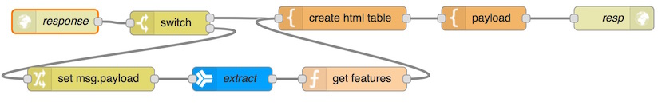
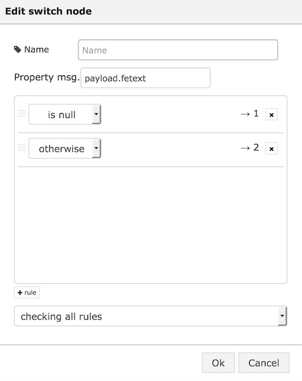
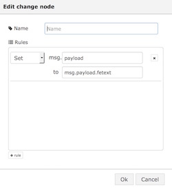
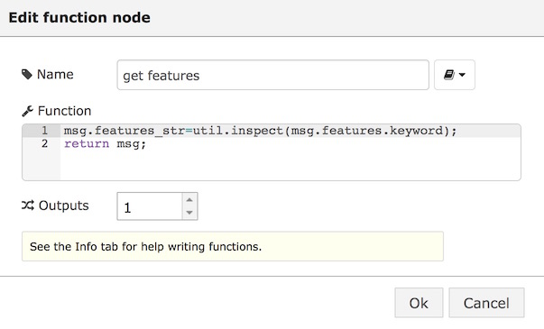

#Create a table from the Alchemy Api features

This lab is an extension of this [Alchemy Feature Extraction lab](../../watson_services_labs/alchemy_api_feature_extraction/lab_alchemy_api_feature_extraction.md).
           

With this extended lab you can easily see what the output of the different features of the Alchemy API Feature Extract node is.
With just a few minor changes you can have a different output.

The final flow looks like this:

First set up a 'http in' node like this:

In have put in resp as this is the response page. but you can add anything.

You can access this page via {http://XXXX.mybluemix.net/resp} where XXXX is the name of your app.

The next node is a 'Switch' node. in the following image you can see how it is configured:

           payload.fetext 

will be used later to add the output to the html page.

From the Switch node the flow will be split. First we connect a 'change' node, to output 2 of the 'switch' node. This change node will set.

           msg.payload.fetext
to

           the msg.payload
see screenshot

Then the actual Alchemy Feature Extract node comes in. You can choose one of the features by using the check box. Iin this case I used Keywords. Remember this feature, it will be used later again.

The next step is setting up a small function:

here you use 

msg.features.keyword

NOTE: the last part of this message can be changed to any other feature, but then you have to select another feature in the previous step.
These are the different features which can be used:
- page-image
- image-kw
- feed
- entity
- keyword
title
author
taxonomy
concept
relation
pub-date
doc-sentiment

