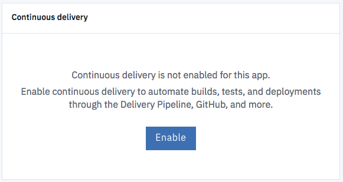
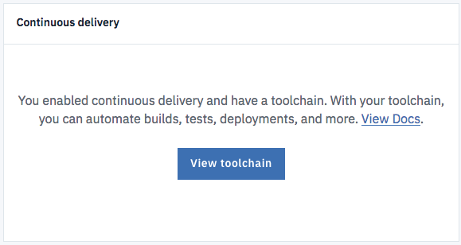
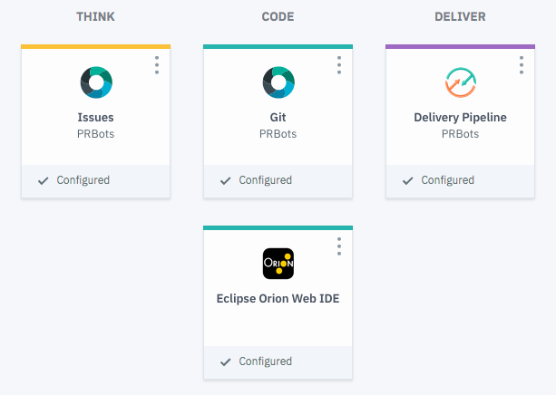
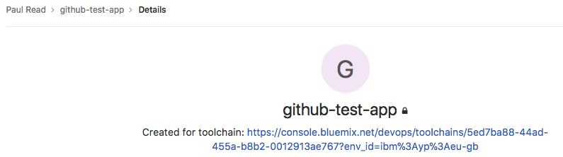
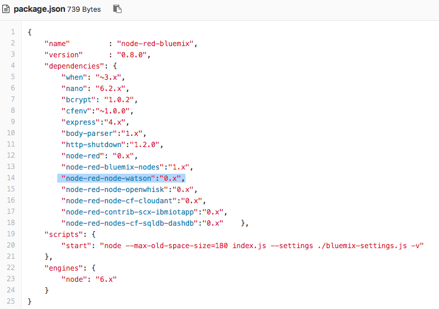
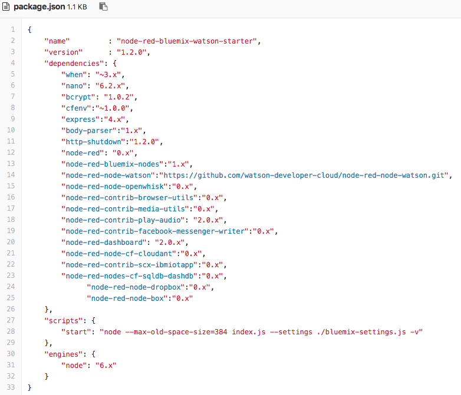
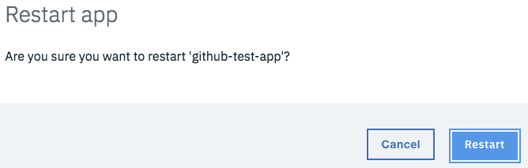
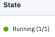

# Installing Watson Developer Cloud Contribution Nodes 

## Node-RED IBM Cloud Boilerplate
Incorporates a collection of nodes to interact with the IBM Watson services in IBM Cloud. The nodes are stored in the node-red-node-watson project in the watson-developer-cloud repository.

## Overview
There will be times when we are working on updates to this project and the updates won't have been published to npm. If you wish to try out these updates before we publish, then you will need to modify Node-RED dependencies. These instructions show how to install these pre-release changes into your Node-RED instance on IBM Cloud. 

Alternatively you can deploy from the [node red bluemix starter repository](https://github.com/watson-developer-cloud/node-red-bluemix-starter), which brings in these nodes, along with box and dropbox nodes that the sample flows make use of to feed data into the Watson nodes. 

## Modify Node-RED Dependencies.
On the IBM Cloud console, select your Node-RED application. On the bottom of the page you will see a panel, that shows if continuous delivery has been enabled. If you do not see



then Continuous Delivery has been enabled and you can go to [App Enabled](#app-enabled) 

Else click on the Enable button to add Continuous Delivery to the app. This will enable you to create a GIT repository for your Node-RED instance. You will see a configuration menu, however you do not need to change any settings so just click on the Create button.  

Once the repository has been created, you will return to main page for the app

### App-Enabled


From the main page click on View Toolchain button to see that Git has been configured



Click on the Git Tile to open a Git tab in the browser. 



The file that you will be changing is "package.json". Select the file and click the edit button. 



Replace the line for node-red-node-watson with a line pointing at the git home for 
the contribution nodes from Watson Developer Cloud. Add the npm modules for the dropbox and box nodes. 

The change is 

```
	 "node-red-node-watson":"https://github.com/watson-developer-cloud/node-red-node-watson.git",
          
	 "node-red-node-dropbox":"0.x",
	 "node-red-node-box":"0.x"	 
	 
```
Your file should look like 



Remember the comma separators at the end of each line except for the last. Commit your changes


Deploy your changes by restarting the app using the restart button 

Confirm that you want restart the app



Wait for Node-RED to restart



The updated nodes will then be available for you to use on the palette.


