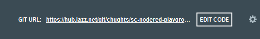
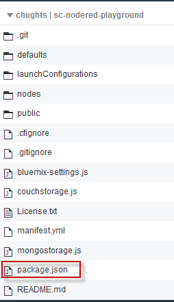
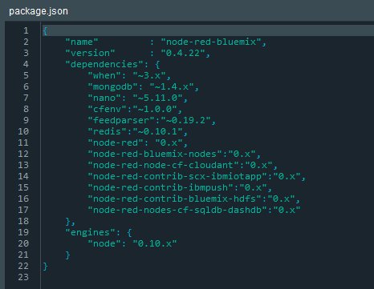
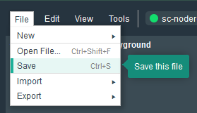
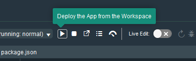
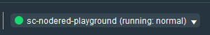

# Installing Watson Developer Cloud Contribution Nodes 

## Node-RED IBM Cloud Boilerplate
The Watson nodes in the node-red-node-watson project in the watson-developer-cloud repo are the Watson nodes that are
included with the Node-RED boilerplate on IBM Cloud.  

## Overview
There will be times when we are working on updates to this project when there will be updates that we haven't yet published to npm. If you wish to try out these updates before we publish, then you will need to modify Node-RED dependencies. These instructions show how to install these pre-release changes into your Node-RED instance on IBM Cloud. Alternatively you can deploy from the [node red bluemix starter repository](https://github.com/watson-developer-cloud/node-red-bluemix-starter), which brings in these nodes, along with box and dropbox nodes that the sample flows make use of to feed data into the Watson nodes. 

## Modify Node-RED Dependencies.
On the IBM Cloud console, select your Node-RED application. At the top right you will see an "ADD GIT" button.


Click on this button. This will create a GIT repository for your Node-RED instance. Once the repository has been created, the
"ADD GIT" button will be replaced with an "Edit Code" button. 



Click on the Edit button. The file that you will be changing is "package.json". 



Select the file. 



Replace the line for node-red-node-watson with a line pointing at the git home for 
the contribution nodes from Watson Developer Cloud. Add the npm modules for the dropbox and box nodes. 


The change is 

```
	 "node-red-node-watson":"https://github.com/watson-developer-cloud/node-red-node-watson.git",
          
	 "node-red-node-dropbox":"0.x",
	 "node-red-node-box":"0.x"	 
	 
```

Remember the comma separators at the end of each line except for the last. Save your changes



Deploy your changes



Wait for Node-RED to restart



The updated nodes will then be available for you to use on the palette.


