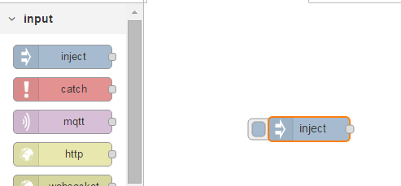
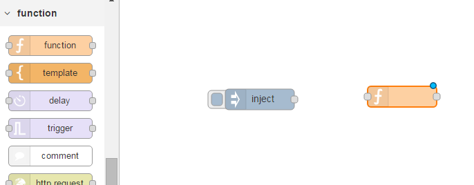
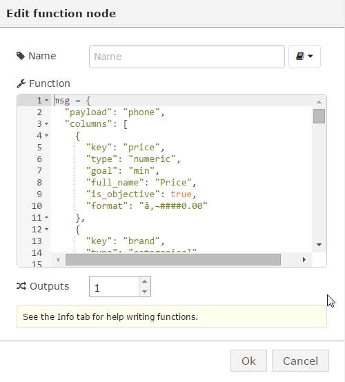
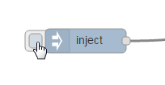
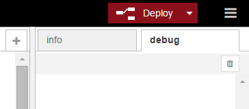

#Tradeoff Analytics

The Tradeoff Analytics service helps people optimize their decisions while striking a balance between multiple, often conflicting, objectives, a full description is described here -> 
http://www.ibm.com/smarterplanet/us/en/ibmwatson/developercloud/tradeoff-analytics.html

The objective of this lab is to pass the same data as in the demo (http://tradeoff-analytics-demo.mybluemix.net/) to the Node-RED Watson node and see what results are obtained.

First go to the demo website and select the Phones scenario from the "Select a scenario" drop down

Scroll down and paste the table and click on "View / Edit JSON" option

Cut/paste the JSON text to a text editor of your choice.

Edit the file and go to the second line (showing "subject: "phone",")

Changes the word "subject" to "payload" and save the file.  Also add the text "msg=" to the first line of the file

For an already modified file see ->  [lab_toff_input.txt](lab_toff_input.txt)

Open your Application and add a TradeOff Service to it.  On your Node-RED application click on "Add a Service or API"

Pick the Tradeoff Analytics service in the Watson section

Your application will be shown, click "Use" to bind the Tradeoff Analytics service to your application

You will be prompted to Restage the application, click Restage.  Wait till the you see "Your app is running"

Click on your App link

Click on the "go to your Node-RED flow editor" button

Drag an inject node to the palette

Drag a Function node to the palette

Drag the Tradeoff Analytics node to the palette

Finally drag a Debug node to the palette and join the nodes up as shown

Double-click the Inject node and change the payload to Blank

Double click the Function node and paste the contents of [lab_toff_input.txt](lab_toff_input.txt) to the function

Click OK

Double-click the Debug node and change msg.payload to msg.resolution

Click the Deploy button

Click on the Debug tab on Node-RED and then return to the palette and click the Inject node so that the flow is triggered

Return to the Debug tab - you should now see the resultant output from the Tradeoff Analytics node

To understand the contents of the output go to ->  [Watson tradeoff](https://www.ibm.com/smarterplanet/us/en/ibmwatson/developercloud/doc/tradeoff-analytics/inout.shtml) and [Explanation of tradeoff JSON](https://developer.ibm.com/answers/questions/191441/need-explanation-of-solutionperspective-response-f.html)

A complete file of the flows is saved here ->[ lab_toff_flow.json](lab_toff_flow.json)

# [Using the Trade-Off Analytics Widget with Node-RED](..\..\watson_advanced_labs\tradeoff_analytics_widget\lab_tradeoff_analytics_widget.md)
